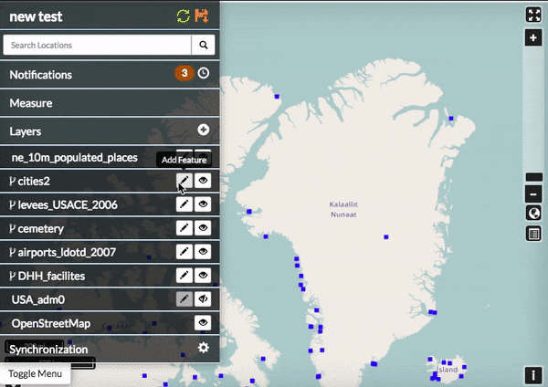
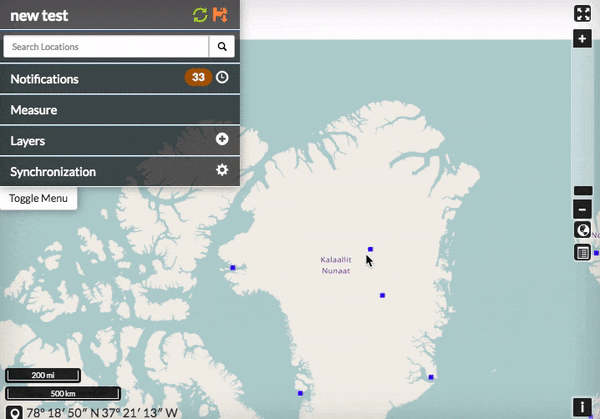

Editing and Version Management
==============================

Edit Features
-------------

Vector layer permissions can be set so the layer can be edited by other users. The editing tools will be available to you in the map, if you have permissions to edit a layer. If a layer was saved as a GeoGig layer, then you can work with the layer's edit history as well.

Add a point feature to a layer
^^^^^^^^^^^^^^^^^^^^^^^^^^^^^^^^^^^^^

A layer that is able to be edited will have the :guilabel:`Add Feature` button available.

  .. figure:: img/add-feature-bttn.png

1. Click the :guilabel:`Add Feature` button next to the layer that is to get the new feature. The Drawing Geometry dialog will open at the top of the map.

2. Click on the map to add your point feature.

3. Click the :guilabel:`Accept Feature` button to keep the geometry. Click the :guilabel:`Cancel Feature` button to remove the added feature.

4. After the feature is accepted, the Edit Attributes window will open. Fill out the fields, or select values from the dropdowns to add attribute values.

5. Click the :guilabel:`Save` button at the bottom of the form to save the feature to the layer.

**Note:** To delete a feature, click on the feature to be removed, and select the Delete Feature button. Select Yes to confirm.

  .. figure:: img/delete-feature.png

Add a line to a layer
^^^^^^^^^^^^^^^^^^^^^

A line layer consists of lines that represent features such as roads, powerlines, waterways, *etc*.

1. Click the :guilabel:`Add Feature` button next to the layer that will get the new feature. The Drawing Geometry dialog will open at the top of the screen.

2. Click on the map to begin drawing the linear feature. Click additional points to add all of the required vertices. Double-click the last vertex to finish drawing the line.

3. Click the :guilabel:`Accept Feature` button to add the geometries to the layer.

4. After accepting the feature, populate the attributes in the Edit Attributes window with any required information.

5. Click the :guilabel:`Save` button to save your changes.

  .. figure:: img/add-lines.gif

**Note:** To add a multi-line feature, select the `Add Geometry` button.

    .. figure:: img/add-lines.png

Add a polygon feature to a layer
^^^^^^^^^^^^^^^^^^^^^^^^^^^^^^^^

Polygons can be used to represent many different features, including buildings, bodies of water, hazardous areas, *etc.*
A simple polygon layer has a single polygon per feature.

1. Click the :guilabel:`Add Feature` button. The Drawing Geometry dialog will open at the top of the screen.

2. Click on the map to begin adding the polygon. Continue to click to add all of the vertices. To finalize the polygon, close the geometry by clicking on the first vertex again.

3. Click the Right Angles button to create right angle corners on your polygon.

4. Click the :guilabel:`Accept Feature` button to add the geometries to the layer.

5. After accepting the feature, populate the attributes in the Edit Attributes window with any required information.

6. Click the :guilabel:`Save` button to save your changes.

  .. figure:: img/add-poly.gif

**Note:** To add a multi-line feature, select the `Add Geometry` button.

  .. figure:: img/add-geometry.png

Edit attributes
^^^^^^^^^^^^^^^

If a layer is able to be edited, Exchange allows you to make attribute changes directly from the map.

1. Select a feature on the map. The feature info box will appear.

2. Click the :guilabel:`Edit Attributes` button to open the Edit Attributes window.

3. Add attribute information as necessary.

4. Click the :guilabel:`Save` button to save your changes.

Edit point geometries on the map
^^^^^^^^^^^^^^^^^^^^^^^^^^^^^^^^

Point layers can be either simple point or multi-points layers. For simple point layer, there is one point per feature. Multi-point layers will have more than one point per feature.

1. Select a point feature on the map to open the feature info box.

2. Click the :guilabel:`Edit Geometry` button. This will open the Drawing Geometry dialog at the top of the screen. Your selected feature will be highlighted in blue.

3. Click and drag the feature to a new location.

4. Click the :guilabel:`Accept Feature` button to save the new feature location. Click the :guilabel:`Cancel` button to cancel your edit.

Edit point geometry manually
^^^^^^^^^^^^^^^^^^^^^^^^^^^^

Coordinates for point geometries can also be edited manually. This is useful when you have the coordinates from another source (such as a report or agency).

1. Select a point feature on the map to open the feature info box.

2. Click the :guilabel:`Edit Attributes` button. The Edit Attributes window will open.

3. Click the Location field to edit the point's coordinates. Add the new location.

4. Click the :guilabel:`Save` button to save your changes.

  .. figure:: img/edit-points-manually.gif

Edit line or polygon geometries
^^^^^^^^^^^^^^^^^^^^^^^^^^^^^^^^

Any existing feature in a layer can be modified, if you have permission to edit the layer. A layer that has been saved to GeoGig will maintain a history of all of the edits to ensure the provenance of the data.

1. Select a feature on the map to be edited. This will open the feature info box.

2. Click the :guilabel:`Edit Geometry` button. The Editing Geometry dialog will open.

3. Mouse over the geometry to highlight the vertex to edit. Click and drag the vertex to a new location. Repeat to edit any additional vertices.

  .. figure:: img/edit-poly.gif

Version Management
------------------

GeoGig is a specialized database that was designed for distributed editing, and supports collaborative editing of geospatial data. It is designed for vector data (point, line, polygon, etc.), and is recommended as the best way to maintain a reliable history of changes to your data.

When a layer has been stored in GeoGig, it maintains the history of all of the edits made to the data, along with who made the changes and when. Within the web map, you can view the history for a layer and for the features.

GeoGig tab in Boundless Exchange
^^^^^^^^^^^^^^^^^^^^^^^^^^^^^^^^

GeoGig layers in Boundless Exchange will have a GeoGig tab in addition to the other tabs on the Layer information page. The history is a list of commits that have been made to the layer.

In the layer information page, click on the GeoGig tab to see the chronological list of commits. The number of commits, and the total number of contributors will display.

   .. figure:: img/geogig-tab.png

      *Commit history within the GeoGig tab*

Notifications
^^^^^^^^^^^^^

Because Exchange is a real time collaboration tool, it is important for users to be able to see what changes other team members are making to a project. When users upload layers, they are given the option to import the layer(s) into GeoGig, which will show who has made what changes (for more on GeoGig, please reference the Working with Layers Management section). If another user has made modifications to a layer currently on the map, a number will appear next to the Notifications indicating how many unread notifications you have. The more notifications, the more changes that have been made to your map layers.

1. Click on the number of unread notifications to open the Notifications list in the layers menu. This will show you all of the changes that have been made to your layer. If there have been multiple changes, they may be grouped into sections based on when the changes occurred. Click on the grouping you would like to view.

  .. figure:: img/notification-list.png

    *Multiple changes were made to this layer, and have been grouped by time.*

2. From here you can either select :guilabel:`View on Map` or :guilabel:`Show Changes` to see what has been modified. View on Map will show you where the changes have been made on the map.

  .. figure:: img/view-on-map.png

  .. figure:: img/show-changes-bttn.png

3. Click the :guilabel:`Show Changes` button. Select :guilabel:`Yes` to acknowledge changes have been made to a feature, and compare the two versions.

  .. figure:: img/compare-changes.png

You will see a detailed side-by-side comparison of the features that have been edited.

  .. figure:: img/side-by-side.png

4. Changes made to the feature attributes will be highlighted in red, green or yellow, depending on whether the change was a deletion, addition or edit. Click the :guilabel:`Show Authors` button, and hover your mouse over the highlighted area to open a detailed description of the individual edit.

  .. figure:: img/show-author.png

5. If you do not approve of the changes, or feel they were made in error, you are able to select the :guilabel:`Undo Changes` button at the bottom of the details window to revert to the original feature.

  .. figure:: img/undo-changes.png

View layer history
^^^^^^^^^^^^^^^^^^

You can view all of the changes made to an entire layer from the map.

1. Select the name of the layer you want to view. The menu will expand to show additional layer options.

2. Click on the :guilabel:`Show History` button. The history will expand.

   .. figure:: img/show-history-bttn.png

3. Hover your mouse over a commit to view details about the changes. The color bar next to the commit indicates the type of edits that were made. Green indicates a new feature was added. Yellow indicates a feature was modified. Red indicates a feature was deleted. A commit can have multiple types of edits. In such cases, the bar will have colors representative of the types of edits that were made.

   .. figure:: img/show-history.png

      *History detail for a commit*

4. Click on a commit, and its history will update to show the individual edits within that commit. MapLoom will make one commit per edit.

   .. figure:: img/summary-changes.png

5. Click the :guilabel:`Show Changes` button to bring up a new window, displaying the specific changes that were made. The changes will be highlighted with the same color coding as the commits. Green means a feature was added. Yellow indicates the feature was changed. Redindicates the feature was deleted. In the image below, the feature was added, and so the feature on the map is highlighted in green.

   .. figure:: img/feature-history-changes.png

View feature history
^^^^^^^^^^^^^^^^^^^^

In addition to viewing the history of edits on a GeoGig layer, you can also view the history of a feature.

1. Select a feature on the map. The feature details will appear.

2. Click the :guilabel:`Show History` button. The history list will expand with the commits that contain changes for that feature.

   .. figure:: img/show-feature-history.png

3. Click the specific commit whose history you’d like to view. The history will update to show the edits made to the feature for that commit. Information about the feature will display as you hover your mouse over the changes.

   .. figure:: img/feature-history.png

4. Click the :guilabel:`Show Changes` button to bring up a new window, displaying the specific changes that were made.

   .. figure:: img/summary-of-changes.png

The changes will be highlighted with the same color coding as the commits. Green means something was added. Yellow means the feature was changed. Red means the feature was deleted. In the image below, the feature was added, and so the feature on the map and its attributes are highlighted in green.

  .. figure:: img/feature-history-diffs.png

5. Click the :guilabel:`Show Authors` button to see the names and dates for every attribute in the feature. Note that through the lifetime of a feature, there can be several authors. This is a good way to see who has contributed to a feature’s current state.

   .. figure:: img/show-authors.png

Summarize history
^^^^^^^^^^^^^^^^^

You can visualize a summary of all of the edits within a date range for a layer.

1. Click the :guilabel:`Show History` button for layer you want to summarize.

   .. figure:: img/show-history-bttn.png

2. Click the :guilabel:`History Summary` button.

   .. figure:: img/history-summary.png

3. Enter the date range for the history to summarize.

   .. figure:: img/date-summary.png

4. Click the :guilabel:`Summarize` button. The edited features will be highlighted, and will be listed under the Summary of Changes field.

   .. figure:: img/summary.png

5. Click the :guilabel:`Show Changes` button for one of the edits in the list to see a detailed view.

Export history
^^^^^^^^^^^^^^

You can export a summary of all of the edits within a date range for a layer.

1. Click the :guilabel:`Show History` button for layer you want to summarize.

   .. figure:: img/show-history-bttn.png

2. Click on the :guilabel:`History Summary` button

   .. figure:: img/history-summary.png

3. Enter the date range for the history to summarize.

   .. figure:: img/export-history.png

4. Click the :guilabel:`Export CSV` button.

5. When prompted to save the file, browse to the location where you want to save it, and click Ok.

All of the feature change history will be added to the spreadsheet.

  .. figure:: img/export-csv.png
