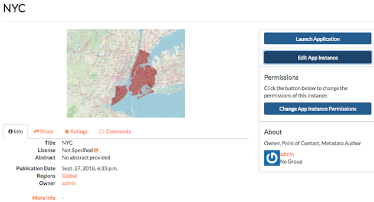
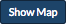
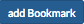
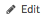
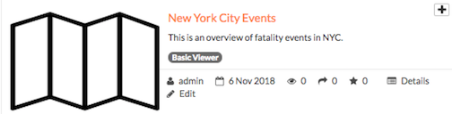
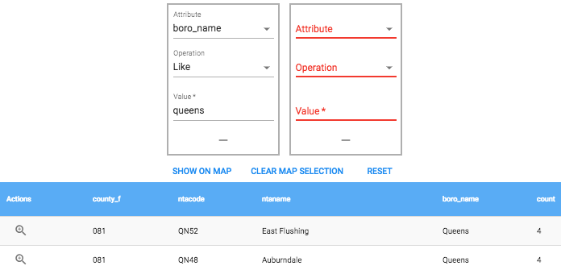

Basic Viewer
============

Exchange was created as a collaborative tool where users can work together to create and edit data. Multiple users can access, change or save maps and layers with limited permissions. The Basic Viewer is different, in that it captures a view of your data, and provides more control over how it is accessed by others. Viewer instances are created using existing Exchange maps, and several configurable components to display and share your information. 

Explore existing viewer instances
---------------------------------

Click the Explore button to open a list of the available viewer instances. The number displayed indicates how many configured viewer instances exist in the system.

  .. figure:: img/basic_viewer/basic-viewer.png

The results will open, displaying all of the available viewers. Search for specific viewers using the text or date filters.

  .. figure:: img/basic_viewer/basic-viewer-filter.png
  
Basic information about each instance is included in the results list. The owner, when the viewer was created, and a brief abstract (if provided) are listed under the title.

  .. figure:: img/basic_viewer/results-list.png
  
Instance details
^^^^^^^^^^^^^^^^

Every instance has a details page, which provides more information about the map, the metadata and who has what permissions for accessing this data. The details page provides a view of the map, and displays any associated comments or ratings.

Select on the Details link |details| to open the instance’s Details page.

    

**Note:**  Depending on the permissions set for a viewer instance, not all users may see all of these options.

Change App Instance Permissions
+++++++++++++++++++++++++++++++

Permissions determine which users can view or edit a viewer instance. The permissions can be set to establish:

* Who can view it?
* Who can download it?
* Who can change metadata for it?
* Who can manage it (update, delete, change permissions, publish/edit)?

Setting the App Instance Permissions for the viewer is important for spelling out who can and cannot view or manage different data. Permissions for the individual layers and the original map must be established prior to setting them for the App Instance.

**Important:** Permissions for individual layers and maps persist to the application instance. If you have limited permissions to layers, they will not be visible to all users, regardless of the permissions set for the application instance. 

1. Click the :guilabel:`Change App Instance Permissions` button in the Permissions section.

  .. figure:: img/basic_viewer/app-perms.png

2.  Establish the permissions for viewing, editing, and managing according to your needs.

**Note:** Setting the permissions to *Anyone can view it* allows you to share the viewer instance link with another user without them needing to log in to Exchange.

  .. figure:: img/basic_viewer/permissions.png

3. Click the :guilabel:`Apply Changes` button to save changes.

Edit instance metadata
++++++++++++++++++++++

Metadata plays an important role for maps. It describes the map in a way that the legend does not; why it was created, the date it was published, and who created it, for example. When a map is updated, it is important to update the metadata, as well. 

**Note:** You can only edit the metadata for the viewer instance if you have the proper permissions.

1. Click the :guilabel:`Edit App Instance` button.

2. Click the :guilabel:`Edit` button under Metadata on the Edit App Instance menu.

  .. figure:: img/basic_viewer/edit-metadata.png
  
3. In the metadata page, fill in the fields with information about the map. The more information you provide, the better others will understand your map. 

4. Click the :guilabel:`Update` button at the top or bottom of the page to save your changes.

**Note:** The “Category” field is a mandatory field, and if it has not previously been selected, you will be required to select one at that time.

Create a new viewer instance
----------------------------

The Basic Viewer combines several configurable components to create a viewer instance that can be shared or viewed by others. The instance map is selected from existing Exchange maps. Please see User Guide section on Working with maps for information on how to :ref:`create a map <createmap>` to use in the Basic Viewer.

Once layers are selected and saved to a map, it can be turned into a viewer instance for use in the Basic Viewer.

  .. figure:: img/basic_viewer/basic-viewer.png
  
1. Click the :guilabel:`Create New` button. Use the components to configure the new viewer instance.

2. Configure the Select Map component. Select a map from the list. 

  Select the radio button next to My Maps to filter just your maps, or open the list to All Maps. Maps can also be searched by title. Selected maps will be highlighted in green.

  .. figure:: img/basic_viewer/create-map.png

3. Select the General component. Verify the title, abstract, and keywords if provided. Add additional information, if desired. Select the :guilabel:`Save` button to save any changes.

  .. figure:: img/basic_viewer/gen-config.png

4. Select the Access Configuration component. As mentioned in the previous section, permissions allow you to set who can have certain access to the viewer instance. **Note:** It is important to remember that permissions set for a map or layers do not have to be the same as for the viewer instance, but they will affect how your instance is viewed by those individuals. For instance, if you specify that a particular individual can change the metadata for a layer, but do not grant them access for the viewer instance, they will not be able to change the metadata for the viewer instance. 

Add the names of users who will have access to the viewer instance. Select users from the drop-down menu or type the names individually. Multiple users can be added for each permission. If you leave all access and permissions open to anyone, you can share the instance URL, and the individual you shared with will not be required to login to Exchange.

Select the :guilabel:`Save` button to save any changes.

  .. figure:: img/basic_viewer/access-config.png
  
5. Select the Bookmarks component. Bookmarks allow you to jump to a saved location on the map. If there are existing bookmarks, they will be listed, along with a brief description and their location.

  .. figure:: img/basic_viewer/bookmarks.png

To create a new bookmark, click the Show Map |map| button , followed by the Add Bookmark |bookmark| button . Zoom to the desired bookmark extent. Provide and name and a brief description (optional) for the bookmark, and select the Save button. 

Select the add bookmark button again to create additional bookmarks. Select the :guilabel:`Remove` button to delete a bookmark. Select the :guilabel:`Save` button to save any changes.

  .. figure:: img/basic_viewer/add-bookmark.png
  
6. Select the Geocoding component. Geocoding allows you to use an address for a location search, rather than relying on coordinates. Select the :guilabel:`Save` button to save any changes.

  .. figure:: img/basic_viewer/geocoding.png

7. Select the Navigation Tools component. Select the checkbox next to the tools you’d like to enable.  Select the :guilabel:`Save` button to save any changes.

  .. figure:: img/basic_viewer/nav-tools.png
  
Once you have saved all of your changes, the viewer instance will be available to explore. Select the Edit link |edit| to return to these settings. Click the title of the instance to open it in the map.

    

Manage viewer instances
-----------------------

The viewer instance will open, centered on the data within the layers. Use the navigation tools to view and explore the instance for a better understanding of the data.

Map features
^^^^^^^^^^^^

Click the :guilabel:`Zoom In (+) / Zoom Out (-)` buttons, or click and drag the scroll bar to zoom in and out on the map.

Click the menu |menu| button to expand the navigation tools. 

To exit the Basic Viewer, select the Home link.

  .. figure:: img/basic_viewer/nav-menu.png

Feature information
^^^^^^^^^^^^^^^^^^^

Click an individual feature on the map. It will be highlighted, and all of its available attribute information will open in a popup window.

  .. figure:: img/basic_viewer/feature-info.png

Layers
------

Click the Layers link to expand the list of layers used in this viewer instance.

  .. figure:: img/basic_viewer/feature-info.png

Layer order
^^^^^^^^^^^

Layers on a map are drawn from bottom to top. The top layer in your list will display on top of any layers below it. Each layer will appear in the order it is displayed in your list. Sometimes a layer may need to be reordered so it can be more clearly displayed.

1. Click on the name of the layer you want to reorder.

2. Drag the layer up or down to the desired position.

Toggle visibility
^^^^^^^^^^^^^^^^^

Layer displays can be turned off and on without having to remove the layer form the map completely.

1. Click the checkbox next to a layer to turn it  off.

2. Click the checkbox next to a layer to turn it back on.

Layer transparency
^^^^^^^^^^^^^^^^^^

The transparency of a layer can be adjusted for viewing the map beneath it. Click and drag the slide button to adjust the transparency. As the transparency increases, you will see more of the map. As opacity increases, the layer features will be more prominent.

  .. figure:: img/basic_viewer/transparency.png

Layer options
^^^^^^^^^^^^^

Open the layer options by clicking on the three dots next to a layer.

  .. figure:: img/basic_viewer/map-options.png

1. Download a Layer -  The layer will download as a .zip package.

2. Metadata Details - Opens the metadata page for the layer. 

3. Copy WFS URL - Copies the WFS URL as a json to the clipboard for use in other applications. 

4. Query/Table - Opens the attribute table for the layer, and allows users to query the data.

Bookmarks
^^^^^^^^^

Any bookmarks that have been created for the viewer instance will be listed here. Click the magnifying glass to zoom to the saved extent.

  .. figure:: img/basic_viewer/bookmark.png

Print tools
^^^^^^^^^^^

Viewer instances can be printed and saved using the Print Tools.

  .. figure:: img/basic_viewer/print-tools.png

**Print PDF** - Save a portion of the map as a PDF.

1. Select the Print PDF option to create a PDF version of the map.

2. Provide a title and an optional comment for the map.

  .. figure:: img/basic_viewer/pdf-title.png

3. Select a layout from the drop-down list. 

4. Click the Show Print Box link to display a box around the area of the map to be printed. The size and direction of the box depends on the layout selected.

5. Click and drag the box to the desired area.

  .. figure:: img/basic_viewer/print-box.png

6. Select a map scale from the drop-down to set the scale of the image.

7. Select the DPI from the drop-down list to refine the printed image.

8. Click the Print link when you are ready to print. Select Cancel to cancel the print process.

Query
^^^^^

Querying data can help with your analysis by returning only the features you want to see. The resulting features can then be displayed on the map on the map, or downloaded into a separate shapefile.

1. Select a layer and a matching type from the drop-down menus.

  .. figure:: img/basic_viewer/select-layer.png

2. Click the add attribute filter button |plus| to create a query.

3. From the drop-down list, select the attribute to be queried and the operator.

The attribute will correspond to the layer you are filtering. The search operator will vary, depending on the attribute values in the table. The search will return values that are equal to (for text or numbers), like (find text that is similar to your entry), greater than, or less than (for integers).

  .. figure:: img/basic_viewer/query-params.png

4. Add the expected attribute value in the Value field. An asterisk **( * )** can be used as a wildcard operator. Select the add attribute filter |plus| button  to add additional filters for further analysis.

5. Click the search |search| button to run the query. All returned results will be listed in the table.

    

6. Select the Show on Map link to display the results on the map. Select Clear Map Selection to remove the highlighted features from the map.

  .. figure:: img/basic_viewer/query-results.png

7. Select Reset to clear the query, and display the attribute table.

Set thumbnail
^^^^^^^^^^^^^

Click Set Thumbnail to save the current map extent as the displayed image in the Basic Viewer instance list.

  .. figure:: img/basic_viewer/thumbnail.png
  
About
^^^^^

Select the About link to display information about the viewer instance.