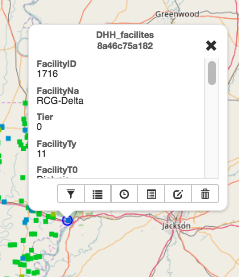

Manage Map Layers
=================

Add layers
^^^^^^^^^^

You can add layers to the map from within the map environment using the Add Layer feature. Layers can be added from either the local geoserver within Exchange, or from a remote service.

The local geoserver hosts layers that have been added to Exchange by other registered users. Local layers can be discovered through an advanced search from the Boundless Exchange homepage, from the Explore Layers page, and from within the map.

A remote service is a separately-hosted data service of varying type (OGC,  Esri, etc). Remote services appear within the map and in search as layers. Rather than having to re-upload the files found within a particular service to Exchange, an external service’s layers are indexed and allow the user to find them and add them to their map.

**Note:** Layers with time enabled features must be added via Explore Layers or the search function from the workspace. They will not function properly if they are added directly from the map.

#. Click the Add Layer :guilabel:`(+)` button in the Layers field.

   .. figure:: img/add-layer-bttn.png

The Add Layers window will open, and you can begin your search using the settings on the left side of the screen.

   .. figure:: img/add-layer.png

2. **Using the map -** Zoom in or out to your area of interest. The list of available layers will change to show you what is within the map extent (minus any layers currently on your map).

Zoom to limit the search to data that includes features in the displayed area. Hover your mouse over a layer in the results list. A bounding box will display over the layer’s coverage area. Each layer will tell you whether it is from the local geoserver, or a remote service.

  .. figure:: img/bounding-box.png

3. **Keywords -** Add keywords to find specific layers. Words associated in the metadata, and the title are used for results. Select the Clear link to remove the filter.

  .. figure:: img/keywords.png

4. **By owner -** Click the checkbox next to an individual’s name to return layers added by that user. If you are collaborating on a project, this is a fast way to find layers from your team members.

  .. figure:: img/by-owner.png

5. **Date Created -** Click and drag the time bar to filter layers by their creation date.

6. **Category -** Click the checkbox next to one or more categories to filter layers by their metadata category.

7. Once your results have been filtered, select the layers you’d like to add to your map from the results list, and click the :guilabel:`Add Layers` button. Your layer(s) will now display on your map, and in the layers list.

  .. figure:: img/added-layers.png

Change layer order
^^^^^^^^^^^^^^^^^^

Layers on a map are drawn from bottom to top. The top layer in your list will display on top of any layers below it. Each layer will appear in the order it is displayed in your list. Sometimes a layer may need to be reordered so it can be more clearly displayed.

#. Click on the name of the layer you want to reorder.

#. Drag the layer up or down to the desired position.

Toggle layer visibility
^^^^^^^^^^^^^^^^^^^^^^^

Toggle Visibility allows you to turn a layer’s display off and on without having to remove the layer form the map completely.

  .. figure:: img/toggle-layer.png

#. Click the Toggle Visibility button to turn a layer off.

#. Click the Toggle Visibility button again to turn a layer back on.

Zoom to data
^^^^^^^^^^^^

The Zoom to data button allows you to center the map quickly on a particular layer. It is particularly convenient when you need to quickly return to the extent of the data for that layer.

#. Click a layer in the layer list.

#. Click the :guilabel:`Zoom to data` button. The map will zoom in and center on that particular layer's extent.

  .. figure:: img/zoom-data.png

.. important:: If a layer’s visibility is dependent on scale, and the data extent is at a lower scale, you will need to zoom in to view the data.

Show layer info
^^^^^^^^^^^^^^^

Information about a layer is available in the map by clicking the Show Layer Info button. Show Layer Info will include server information, basic metadata, and the projection (SRS).

#. Click on a layer name in the layer list to expand the layer options.

#. Click the :guilabel:`Show Layer Info` button.

  .. figure:: img/show-info.png

The Layer Info window will display.

   .. figure:: img/layer-info.png

Remove a layer from the map
^^^^^^^^^^^^^^^^^^^^^^^^^^^

#. To remove a layer from the map, click the name of the layer you’d like to remove, and click the :guilabel:`Remove layer` button in the layer tools.

   .. figure:: img/remove-layer.png

#. Click the :guilabel:`Yes` button to confirm.

   .. figure:: img/confirm-remove.png

Modify layer transparency
^^^^^^^^^^^^^^^^^^^^^^^^^

The transparency of a layer can be adjusted for viewing the map beneath the layer. Click and drag the slide button to adjust the transparency. As the transparency increases, you will see more of the map. As opacity increases, the layer features will be more prominent.

  .. figure:: img/transparency.png
  
  .. figure:: img/more-transparent.png
  
    *Example of increased transparency*
  
  .. figure:: img/more-opacity.png
  
    *Example of no transparency selected*

Get feature information
^^^^^^^^^^^^^^^^^^^^^^^

To get information for a feature, simply click the feature on the map. Once you select a feature, the information window will display. The point of the information window will touch the feature you clicked.

**Note:** Get feature information is now available for a WMS remote service, but external services do not provide as much data as other layers and will have a more simplified display.

  .. figure:: img/wms-popup.png

    *This is an example of a feature from a WMS layer*

Change attribute visibility
^^^^^^^^^^^^^^^^^^^^^^^^^^^

Individual attribute visibility can be turned off and on in a feature window. This can make managing large numbers of attribute fields in a layer easier.

#. In the layers list on the map, select on the layer whose attribute visibility you'd like to change.  The layer’s additional options will display.

2. Click the :guilabel:`Show Attribute Visibility` button to open the list of attributes for the layer.

  .. figure:: img/attribute-visibility.png

3. Click on the :guilabel:`Toggle Visibility` button for an attribute to turn it off and on.

  .. figure:: img/layer-attribute-visibility.png

4. Select a feature on the map from that layer. The attribute will no longer appear in the feature information window, as it has been toggled off. Repeat these steps to toggle it back on.