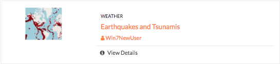
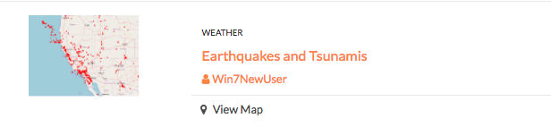

Manage Maps
===========

Every map has its own details page, which provides more information about the map, the metadata and who has what permissions for making edits.

Click the **View Details** link to open the details page.

  .. figure:: img/view-details2.png

The map details page provides a view of the map, and displays any associated comments or ratings.

  .. figure:: img/map-details.png

All associated layers and documents will be listed, with links to their respective details pages. Simply click the title of the associated file to open the page.

  .. figure:: img/associated.png

Edit map metadata
^^^^^^^^^^^^^^^^^

Metadata plays an important role for maps. It describes the map in a way that the legend does not; why it was created, the date it was published, and who created it, for example. When a map is updated, it is important to update the metadata, as well.

**Note:** You can only edit the metadata for the map if you have the proper permissions.

1. Click the :guilabel:`Edit Map` button.

2. Click the :guilabel:`Edit` button under Metadata on the Edit Map menu.

   .. figure:: img/edit-map.png

3. In the metadata page, fill in the fields with information about the map. The more information you provide, the better others will understand your map.

**Note:** The “Category” field is a mandatory field, and if it has not previously been selected, you will be required to select one at that time.

4. Click the :guilabel:`Update` button to save your changes.

Set map thumbnail
^^^^^^^^^^^^^^^^^

By default the thumbnail images for maps will only have the vector layers. In order to include the background map you will need to use the Set Map Thumbnail button.

1. Pan and/or zoom the inset map on the **Map Details** page so that it’s centered on the view you would like for the map thumbnail.

2. Click the :guilabel:`Edit Map` button.

3. Click the :guilabel:`Set` button under Thumbnail on the Edit Map menu.

   .. figure:: img/edit-map.png

This will set the map thumbnail with the base map and layers included.

  *Old Thumbnail*

   *New Thumbnail*

Create a custom thumbnail
^^^^^^^^^^^^^^^^^^^^^^^^^

Custom images related to your map can be created, and will display next to the map on the Explore Maps page.

1. From the map’s info page, click the :guilabel:`Edit Map` button.

  .. figure:: img/edit-map-bttn.png

2. Click the :guilabel:`Set from File` button to browse to the image. Select the image you want to use, and verify it displays in the thumbnail section.

  .. figure:: img/file-thumbnail.png

Edit map permissions
^^^^^^^^^^^^^^^^^^^^

The map permissions determine which users can view or edit a map. The permissions can be set to establish:

* Who can view it?
* Who can download it?
* Who can change metadata for it?
* Who can manage it (update, delete, change permissions, publish/edit)?

#. Click the :guilabel:`Change Permissions of this Map` button in the Permissions section.

    .. figure:: img/permissions.png

#. Establish the permissions for viewing, editing, and managing according to your needs.

    .. figure:: img/set-permissions.png

#. Click the **Apply Changes** button to save changes.

Remove a map
^^^^^^^^^^^^

You are able to remove a map from Exchange. It is important to note that this will remove the map for all users.

#. Click the :guilabel:`Edit Map` button.

   .. figure:: img/edit-map.png

#. Click the red :guilabel:`Remove` button under Map in the Edit Map menu.

#. Click the :guilabel:`Yes` button to confirm.

  .. figure:: img/remove-map.png