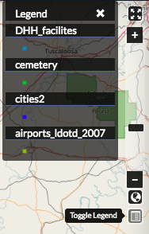

Additional Map Features
=======================

Search for locations
^^^^^^^^^^^^^^^^^^^^

Find a specific location on the map simply by typing the name of a place, zip code, address or lat/long (DMS or DD) in the Search Locations textbox. Click the search button to return a list of possible matches. Scroll through the list, and select one of the matches. The map will recenter on that location. This is a simple search, and does not allow wildcards.

  .. figure:: img/search-locations.png

Using the legend
^^^^^^^^^^^^^^^^

A legend displayed the symbols used for vector layers in a map. It can be toggled off and on to maximize screen space when necessary.

Click the Toggle Legend button to toggle the legend off and on.

Full screen and zoom
^^^^^^^^^^^^^^^^^^^^

There are additional features which allow you to change your coordinate display, your full screen extent, and your map scale.

1. Click the :guilabel:`Toggle Full Screen` button to maximize your map environment to the full screen.

  .. figure:: img/toggle-full-screen.png

2. Click the :guilabel:`Zoom In (+) / Zoom Out (-)` buttons, or click and drag the scroll bar to zoom in and out on the map. Click the :guilabel:`Zoom to World` button to return to the world view.

  .. figure:: img/zoom-buttons.png

Change coordinate display
^^^^^^^^^^^^^^^^^^^^^^^^^

1. Click the :guilabel:`Switch Coordinate Display` button, in the lower left corner of your map, to change the coordinate system. Your available options are DMS, DD (or XY) and MGRS. 

2. Click the button additional times to cycle through to your desired display. Your scale bar is located just above the coordinate display.

  .. figure:: img/coord-display.png

Measure distance or area
^^^^^^^^^^^^^^^^^^^^^^^^

You can measure distance or areas on your map using the Measure tool.

1. To measure an area or distance on the map, select the Measure field. The measure tools will open, and you can select whether you want to measure a line distance, or an area.

2. **Area** - Click the :guilabel:`Area` button in the Measure tools. Begin drawing by clicking your mouse on your map at your starting point. Click subsequent points around the area you want to measure.  To complete your measurement, you will need to ensure you close your polygon by clicking on your starting point.

  .. figure:: img/measure-area.gif

  **Line** - Click the Length button in the Measure tools. Begin drawing by clicking your mouse at your starting point. Click subsequent points along the route or feature you want to measure.

  .. figure:: img/measure-line.gif

3. To complete your measurement, click your mouse at the end distance. The line will turn from a bold blue to a thin blue line. The distance will display as meters/kilometers, miles or feet, depending which unit you have selected.

4. Click the :guilabel:`Stop Measuring` button to clear your map and measurements.

Save a map
^^^^^^^^^^

Saving a map allows you to maintain your preferences for the next use, as well as makes it available for other Exchange users.

1. Click the :guilabel:`Save this map` button.

  .. figure:: img/save-map.png

2. Add a title and an abstract for your map so it is searchable by others. Click the Save button to save your changes. The name will be reflected in the title, and replace “New Map.”

3. Select the Refresh Interval drop-down menu to choose a refresh rate for your map. This will help ensure your map is as current as possible.

  .. figure:: img/save-this-map.png

The Map is now saved in the list of maps on the Maps page.

For MapLoom version info, hover the mouse over the **i** info button in the lower left corner of the window.

Share a saved map
^^^^^^^^^^^^^^^^^

A link will be created for your saved map. Copy the link to share with other users. 

  .. figure:: img/share-map.png

Create a copy of a map
^^^^^^^^^^^^^^^^^^^^^^

You can use an existing map as a starting point for another map. This allows you to incorporate the work others have done without changing their maps.

1. Click **Maps** on the  Boundless Exchange toolbar, and select Explore Maps in the drop-down menu.

2. Select on the map you would like to copy. This will open the map details page.

3. Click the :guilabel:`Create a New Map` button under the Copy this map section.

   .. figure:: img/copy-map.png

A new map will open, populated with all of the layers of the map you copied.

4. Click the :guilabel:`Save this map` button on the toolbar.

5. Add a new title and an abstract, possibly indicating this is a copy of another map.

6. Click the :guilabel:`Save Copy` button.

Your new map is now saved, and can be accessed from the maps page.

.. important:: You are only copying the map. Any changes you make to the layer (data set) will affect any maps using that layer. Copying the map would primarily be used to make visual changes. To make changes to the data, it is recommended that you download the layer, and import your own copy.